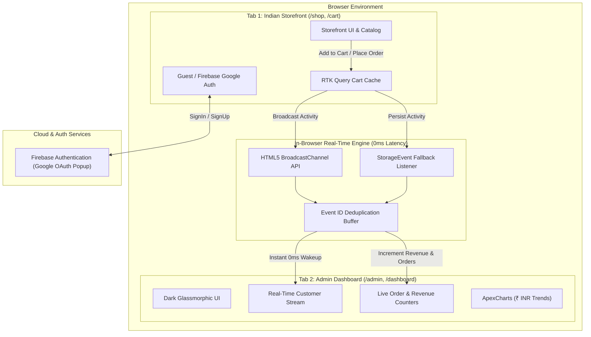

# 🛒 KeethanKart — Next-Generation Indian E-Commerce & Real-Time Analytics Platform

[](https://nextjs.org/)
[](https://react.dev/)
[](https://www.typescriptlang.org/)
[](https://tailwindcss.com/)
[](https://firebase.google.com/)
[](LICENSE)

**KeethanKart** is a production-grade, full-stack Indian e-commerce web platform and real-time administrative analytics suite engineered with **Next.js 15 (App Router)**, **React 19**, **Redux Toolkit**, **Apollo GraphQL**, and **Firebase Authentication**.

It features an authentic **Indian consumer product catalog (₹ INR)**, a **0ms latency real-time cross-tab customer broadcast engine**, and a high-contrast **Dark Glassmorphic ("Glamourism") Superadmin Dashboard**.

---

## 🏗️ System Architecture



---

## 🌟 Key Features

### 1. 🇮🇳 Authentic Indian Catalog & ₹ INR Currency
- Fully localized with genuine Indian consumer electronics and ethnic fashion (*Samsung Galaxy S24 Ultra, Redmi Note 13 Pro, boAt Airdopes 141, Noise ColorFit Pro 4, Manyavar Silk Kurta Set, Fabindia Silk Saree*).
- Indian standard pricing, commas, and rupee formatting (`₹18,45,290`).

### 2. ⚡ 0ms Latency Real-Time Cross-Tab Customer Sync
- Built on the browser-native **HTML5 `BroadcastChannel` API** and **`StorageEvent`** synchronization.
- When any customer (guest or authenticated) clicks **Add to Cart** or completes **Express Checkout** in one tab, the **Admin Dashboard** in another tab instantly animates the new event, updates the order counter, and increases total revenue without page reloads or server latency.

### 3. 🛡️ Direct Superadmin Access (`/admin`)
- Visiting `/admin` automatically elevates the session to **Keethan R (Superadmin)** and seamlessly routes to the administrative suite.
- Rebuilt with a **Dark Glassmorphic ("Glamourism")** design language, glowing saffron/gold borders, frosted backdrop blurs, and responsive mobile navigation.

### 4. 🔐 Firebase Google Authentication & Guest Checkout
- Integrated with Firebase Web SDK v12 (`keethankart` project).
- Real **Google Sign-In** and **Google Sign-Up** popup flows with user display name and avatar synchronization.
- **Express Guest Checkout** allowing instant one-click order placement without mandatory registration.

### 5. 📊 Interactive ApexCharts Analytics Suite
- Dark-themed revenue growth area charts with ₹ Lakhs/k value formatting.
- Sales by product category bar charts and conversion donut charts.
- Top-performing products list with real thumbnails and units sold metrics.

### 6. 🧾 Rich Order Receipt Card
- Post-checkout confirmation screen featuring an **Order Receipt Card** with exact item breakdowns, amount paid, payment badge (`💳 Paid via Card / UPI · Confirmed`), and estimated delivery timeline.

### 7. 🚀 100% Zero-Backend Deployment Readiness
- Runs in an intelligent in-browser mock mode by default (`NEXT_PUBLIC_DEMO_MODE !== "false"`).
- Deploys straight to **Vercel** or **GitHub Pages** with zero configuration, no external database maintenance, and complete full-stack interactivity.

---

## 🚀 Quick Start (Local Setup)

### Prerequisites
- **Node.js**: v18+ (Node 20+ recommended)
- **Bun** or **npm**

### Step 1: Clone the repository
```bash
git clone https://github.com/keerthanrd17-dotcom/KeethanKart-.git
cd KeethanKart-
```

### Step 2: Install dependencies
```bash
cd src/client
bun install
# or
npm install
```

### Step 3: Run the development server
```bash
bun run dev
# or
npm run dev
```

- **Storefront**: [http://localhost:3000](http://localhost:3000)
- **Admin Dashboard**: [http://localhost:3000/admin](http://localhost:3000/admin)

---

## 🧪 Live Demonstration Guide (For Viva / Evaluation)

To demonstrate the real-time cross-tab synchronization during evaluation:

1. **Open the Admin Dashboard**: Open [http://localhost:3000/admin](http://localhost:3000/admin) in **Browser Tab 1**. Notice the pulsing green `🟢 LIVE BROADCAST (0ms LATENCY)` indicator.
2. **Open the Storefront**: Open [http://localhost:3000/shop](http://localhost:3000/shop) in **Browser Tab 2**.
3. **Trigger Real-Time Cart Action**:
   - In Tab 2, click **Add to Cart** on any item (e.g. *boAt Airdopes 141*).
   - In Tab 1, the event card appears instantly at the top of the **Real-Time Customer Stream**.
4. **Trigger Real-Time Order Placement**:
   - In Tab 2, go to `/cart` and click **"Express Checkout as Guest"**.
   - Tab 2 displays the **Order Receipt Card** (`#KK-XXXXXX`) with ₹ amount and confirmation badge.
   - Look at Tab 1: An emerald **Order Confirmed** card pops up immediately, **Total Orders** ticks up by 1, and **Total Revenue** increments live!

---

## 📁 Repository Structure

```
keethankart-ecommerce/
├── .github/
│   └── workflows/
│       └── ci.yml               # Automated Next.js build verification CI
├── src/
│   ├── client/                  # Next.js 15 Frontend & Admin App
│   │   ├── app/
│   │   │   ├── (auth)/          # Google popup sign-in & sign-up
│   │   │   ├── (private)/       # Dark glassmorphic admin dashboard
│   │   │   ├── (public)/        # Shop, cart, product detail, success
│   │   │   ├── admin/           # Direct superadmin auto-elevation entry
│   │   │   ├── components/      # UI components (Atomic design)
│   │   │   ├── lib/
│   │   │   │   ├── demo/        # In-browser engine, catalog fixtures, realtime sync
│   │   │   │   └── firebase.ts  # Firebase App & Google auth provider
│   │   │   └── store/           # Redux Toolkit store & RTK Query APIs
│   │   ├── package.json
│   │   └── next.config.ts
│   └── server/                  # Optional Express / Prisma / PostgreSQL API
├── CONTRIBUTING.md
├── MAINTENANCE.md
├── SECURITY.md
├── LICENSE                      # MIT License (Keethan R)
└── README.md
```

---

## 🌐 Live Deployment (GitHub Pages)

- **Live Storefront & Admin Portal**: **[https://keerthanrd17-dotcom.github.io/KeethanKart-/](https://keerthanrd17-dotcom.github.io/KeethanKart-/)**
- **Automated CI/CD**: Powered by `.github/workflows/nextjs.yml` with zero external dependencies. Every push to `main` automatically builds and publishes the live site!

---

## 👨‍💻 Author & Academic Information

- **Student / Engineer**: Keethan R
- **Email**: [keerthanr.d17@gmail.com](mailto:keerthanr.d17@gmail.com)
- **GitHub Repository**: [https://github.com/keerthanrd17-dotcom/KeethanKart-](https://github.com/keerthanrd17-dotcom/KeethanKart-)
- **Live Deployment**: [https://keerthanrd17-dotcom.github.io/KeethanKart-/](https://keerthanrd17-dotcom.github.io/KeethanKart-/)
- **Project**: KeethanKart E-Commerce & Real-Time Analytics Platform
- **Academic Domain**: Full-Stack Web Development & Real-Time Systems
- **License**: MIT License (2025–2026)
